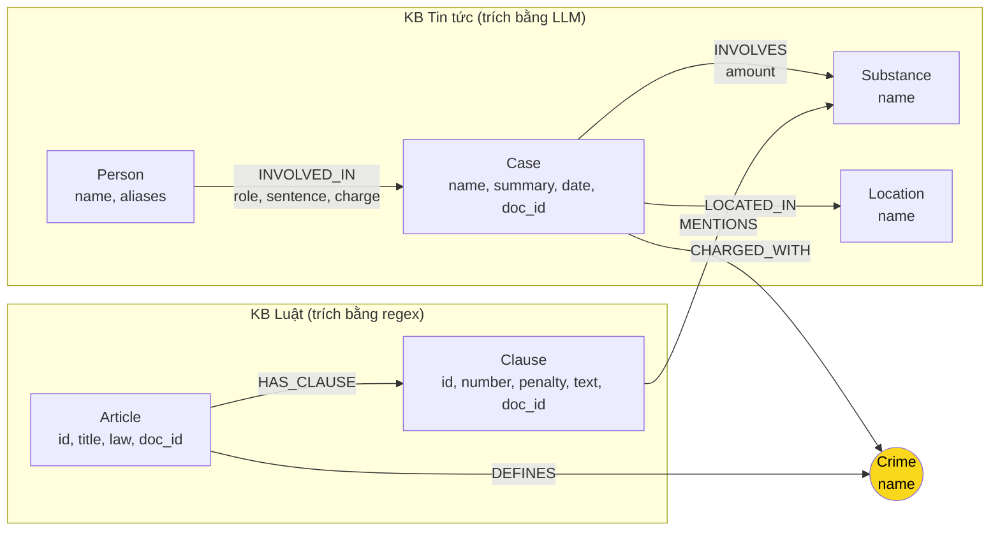

# Thiết kế Ontology — Day 19

**Họ tên:** Lê Thanh Truong  **MSSV:** 2A202602492

**Lựa chọn** (đánh dấu một):
- [x] Dùng ontology gợi ý (có thể chỉnh nhỏ)
- [ ] Tự thiết kế (xét bonus +15, xem `SUBMISSION.md`)

> Ontology này là ontology gợi ý trong `src/graph.py`, dùng nguyên cấu trúc, **có một chỉnh sửa nhỏ ở
> KG-1** (thêm guard chống nối sai, mục 6). Vì vậy **không xét bonus +15** — mục 7 để trống.

## 1. Sơ đồ

Node cầu nối là `Crime` (tô vàng): nó là label duy nhất có mặt ở **cả hai** KB.



Đường đi xuyên 2 KB (dùng cho mọi câu `cross-kb`):

```
(:Case)-[:CHARGED_WITH]->(:Crime)<-[:DEFINES]-(:Article)-[:HAS_CLAUSE]->(:Clause)
```

## 2. Entity types (node labels)

| Label | Ý nghĩa | Khóa định danh (`MERGE` theo) | Properties | Lấy từ KB nào | Trích bằng |
| --- | --- | --- | --- | --- | --- |
| `Article` | Một Điều luật | `id` (`"Điều 251 BLHS"`) | `id`, `title`, `law`, `doc_id` | Luật | regex |
| `Clause` | Một khoản trong Điều | `id` (`"Điều 251 BLHS khoản 1"`) | `id`, `number`, `penalty`, `text`, `doc_id` | Luật | regex |
| `Crime` | Tội danh — **node cầu nối** | `name` (đã chuẩn hóa, bỏ tiền tố "Tội ") | `name` | Luật (tiêu đề Điều) | regex + `normalize_crime` |
| `Case` | Một vụ việc trong bài báo | `name` (LLM tự đặt) | `name`, `summary`, `date`, `doc_id`, `source_title` | Tin | LLM |
| `Person` | Người liên quan | `name` | `name`, `aliases` | Tin | LLM |
| `Substance` | Chất ma túy | `name` | `name` | **Cả hai** | regex (`find_substances`, luật) / LLM (tin) |
| `Location` | Tỉnh/thành | `name` | `name` | Tin | LLM |

**Bốn label không mang `doc_id`** — đúng danh sách `bench_kg.py --build` in ra ở dòng
"Label không có doc_id: Location, Substance, Person, Crime". Trong đó:

- `Crime` và `Substance` **hợp lệ**: chúng là node **dùng chung** giữa nhiều tài liệu — đó chính là
  điều kiện để `MERGE` gộp được (`"Điều 251"` và `"Điều 250"` cùng trỏ về một `Crime`; một chất xuất
  hiện ở cả luật lẫn tin). Nếu chúng mang `doc_id` thì `MERGE` sẽ tách node theo tài liệu và **cầu nối
  sẽ gãy**.
- `Person` và `Location` cũng là node dùng chung (cùng một người/tỉnh xuất hiện ở nhiều bài), nhưng
  ở đây việc dùng chung có **đánh đổi thật**: gộp đúng thì tiện cho câu hỏi xuyên bài, nhưng **mất
  khả năng truy vết** — không trả lời được "người này được nhắc ở bài nào". Xem mục 8, hạn chế 6.

## 3. Relationships

| Type | Từ → Đến | Properties trên cạnh | Ý nghĩa |
| --- | --- | --- | --- |
| `DEFINES` | `Article` → `Crime` | — | Điều này định nghĩa tội danh gì |
| `HAS_CLAUSE` | `Article` → `Clause` | — | Điều gồm các khoản |
| `MENTIONS` | `Clause` → `Substance` | — | Khoản này nói tới chất gì (dùng để lọc khoản theo khối lượng) |
| `CHARGED_WITH` | `Case` → `Crime` | — | Vụ án bị truy tố tội gì — **nửa tin của cầu nối** |
| `INVOLVES` | `Case` → `Substance` | `amount` (khối lượng dạng chuỗi) | Vụ án liên quan chất gì, bao nhiêu |
| `LOCATED_IN` | `Case` → `Location` | — | Vụ án xảy ra ở đâu |
| `INVOLVED_IN` | `Person` → `Case` | `role`, `sentence`, `charge` | Vai trò, mức án, tội danh **của riêng người này** |

`sentence` nằm trên **cạnh** `INVOLVED_IN`, không trên node `Person`: cùng một người có thể bị
tuyên mức án khác nhau ở các vụ khác nhau, nên nó là thuộc tính của *quan hệ*, không của *thực thể*.

## 4. Node cầu nối giữa 2 KB

- **Node nào:** `Crime` (tội danh).
- **Vì sao chọn node này:** đây là **thứ duy nhất** mà cả hai KB cùng nói tới. Luật nói bằng tiêu đề
  Điều (`"Điều 251 BLHS. Tội mua bán trái phép chất ma túy"`), tin nói bằng câu văn
  (`"...bị tuyên phạt 36 tháng tù về tội mua bán trái phép chất ma túy"`). `Substance` cũng có ở cả
  hai KB nhưng yếu hơn: nó chỉ cho biết *chất*, không cho biết *khung hình phạt* — mà khung hình
  phạt mới là thứ câu hỏi Q3–Q5 cần. Không có `Crime` thì không có đường nào từ một vụ án cụ thể
  sang một Điều luật cụ thể.
- **Cách đảm bảo hai phía khớp tên:**
  1. Phía luật là **chuẩn**: `known_crimes` lấy từ tiêu đề Điều, đưa thẳng vào prompt trích xuất
     (`DANH SÁCH TỘI DANH`), LLM bị yêu cầu *"BẮT BUỘC chọn đúng nguyên văn"*.
  2. Phía tin được `link_entity` map về tên chuẩn: chuẩn hóa 2 phía (bỏ tiền tố "Tội ", lowercase,
     gộp khoảng trắng) → khớp chính xác → `difflib.get_close_matches(cutoff=0.9)` (xem mục 6, quyết
     định 1, vì sao là 0.9 chứ không phải 0.8 như HINT).
  3. `link_entity` trả về **cách viết gốc trong `known`**, nên node `Crime` chỉ có một cách viết
     duy nhất → `MERGE` gộp được.
- **Khi nào cầu gãy, và xử lý thế nào:**
  - **Gãy loại 1 — LLM không điền `charges`:** `CHARGED_WITH` không được tạo → mất đường sang luật.
    **Đây là nguyên nhân gãy duy nhất tôi đo được** (xem lỗi E1 ở `REPORT_KG.md`): 4/16 vụ gãy, và cả
    4 bài gốc **không hề chứa tên tội danh chuẩn nào** — 2 vụ đúng là chưa thành tội (mới bắt giữ /
    chưa xác định chủ hàng), 2 vụ là lỗi trích xuất thật.
  - **Gãy loại 2 — tên tội quá khác:** `link_entity` trả `None`. Tôi đã đo: điều này **không** xảy ra
    trên KB này. Ví dụ `"tổ chức sử dụng trái phép chất ma túy"` (tội có thật) link đúng ở
    **1.0000**, hoàn toàn không bị cutoff chặn.
  - **Gãy loại 3 — nối sai sang tội gần giống:** đây là nguy cơ **thật và lớn nhất**, vì nó không báo
    lỗi. Đã xử lý; xem mục 6 quyết định 1.
  - **Xử lý:** `link_entity` **không đoán bừa**. Về phía truy vấn, `context()` bù lại bằng cách vẫn
    trả về dữ kiện 1 bước quanh seed (`seed_facts`) và các Điều **được nhắc thẳng trong câu hỏi**
    (`re.findall(r"[Đđ]iều (\d+)", question)`) — nên câu hỏi kiểu "Điều 251 quy định gì" vẫn trả lời
    được kể cả khi cầu gãy hoàn toàn.

## 5. Competency questions

Ký hiệu: `C→CW→Cr←DEF→A→HC→CL` = `Case -CHARGED_WITH-> Crime <-DEFINES- Article -HAS_CLAUSE-> Clause`.

| Câu | Đường đi (Cypher pattern) | Trả lời được? |
| --- | --- | --- |
| Q1 | *(không qua graph)* — `Article` của Luật PCMT không `DEFINES` `Crime` nào, nên `context()` không có đường tới Điều 2. Câu này **Flat RAG gánh**: vector search lấy thẳng chunk Luật PCMT. | Một phần — graph không đóng góp gì |
| Q2 | `(:Person)-[:INVOLVED_IN {sentence}]->(:Case)` — tìm người có `sentence` chứa "tử hình" | Có |
| Q3 | `C→CW→Cr←DEF→A→HC→CL WHERE CL.number = 1` → `[Điều 251 BLHS] khoản 1: ... 02 năm đến 07 năm` | Có |
| Q4 | `C→CW→Cr` (tội "tổ chức sử dụng") `←DEF→A` = Điều 255 `→HC→CL` lọc theo chất mà `C→INVOLVES` | Có, **nhưng** khung *tối đa* nằm ở khoản cao, không phải khoản 1 — xem lỗi E2 |
| Q5 | `C→INVOLVES→(MDMA {amount})` rồi `C→CW→Cr←DEF→A→HC→CL WHERE (CL)-[:MENTIONS]->(:Substance {name:'MDMA'})` → khoản 4 Điều 250 | Có — đây là câu graph **mạnh nhất** |
| Q6 | `(:Case)-[:INVOLVES]->(:Substance {name:'MDMA'})` trả về `Case.name` — đúng một bước, Flat RAG không làm nổi vì phải gom từ nhiều bài | Có, **nhưng** trả lời *sai* vì trùng node `Case` — xem lỗi E3 |

**Q1 là câu ontology này không trả lời được bằng graph.** Lý do: Luật Phòng, chống ma túy 2021 là
văn bản **định nghĩa**, không phải văn bản **quy định tội** — nó không có `Crime` để làm cầu nối, mà
cầu nối `Crime` là cơ chế duy nhất để `context()` đi từ một seed sang một `Article` khác. Hệ quả đo
được: Q1 GraphRAG chỉ nhận thêm nhiễu, không nhận thêm thông tin.

**Hai câu graph "trả lời được" nhưng trả lời sai** — Q4 (thiếu khoản tối đa, E2) và Q6 (đếm trùng vụ,
E3) — chính là điểm đáng chú ý nhất của lab: *có đường đi trên graph không đồng nghĩa với câu trả lời
đúng*. Chi tiết và bằng chứng ở `REPORT_KG.md` mục 3.

## 6. Quyết định thiết kế và đánh đổi

**1. Nâng cutoff fuzzy của `link_entity` từ 0.8 lên 0.9 (khác ontology gợi ý).**
- *Đã chọn:* giữ nguyên `difflib.get_close_matches`, chỉ đổi `cutoff=0.8` → `cutoff=0.9` (hằng số
  `FUZZY_CUTOFF` trong `src/graph.py`).
- *Phương án khác:* dùng nguyên `cutoff=0.8` như HINT.
- *Vì sao:* 0.8 **không tách được** "biến thể chính tả" khỏi "tội khác" trong bộ 13 tội danh Chương
  XX. Tôi đo bằng `difflib.SequenceMatcher` trên đúng 13 tên tội trong KB:

  | Cặp chuỗi | Tỉ lệ | Cùng một tội? |
  | --- | --- | --- |
  | `vận chuyển trái phép chất ma tuý` vs `vận chuyển trái phép chất ma túy` | 0.9375 | ✔ biến thể |
  | `Tội Mua bán trái phép chất ma tuý` vs `mua bán trái phép chất ma túy` | 0.9310 | ✔ biến thể |
  | **`sử dụng trái phép chất ma túy` vs `tổ chức sử dụng trái phép chất ma túy` (Điều 255)** | **0.8788** | ✘ **tội khác** |
  | **`sử dụng trái phép chất ma túy` vs `mua bán trái phép chất ma túy` (Điều 251)** | **0.8276** | ✘ **tội khác** |
  | `cưỡng bức người khác sử dụng…` vs `lôi kéo người khác sử dụng…` (cao nhất giữa 13 tội) | 0.8571 | ✘ tội khác |

  Khoảng cách rất rõ: **biến thể thật ≥ 0.93, tội khác ≤ 0.88**. Đặt cutoff ở 0.9 (giữa hai nhóm)
  phân tách sạch. Quét toàn bộ 13 tội với 4 dạng biến thể mỗi tên (đổi dấu `tuý`/`túy`, thêm tiền tố
  "Tội ", đổi hoa/thường, thêm khoảng trắng) = **52/52 biến thể link đúng ở cả 0.8 lẫn 0.9**; nhưng
  trên 9 tên *không nên* link thì 0.8 nối sai 1 (`sử dụng trái phép chất ma túy` → Điều 255) còn
  0.9 từ chối đúng **9/9**.
- *Vì sao không dùng cách khác:* trước đó tôi thử một guard "một chuỗi là chuỗi con của chuỗi kia thì
  từ chối". Guard đó **bỏ sót** cặp 0.8276 ở trên, vì `sử dụng trái phép chất ma túy` **không phải**
  chuỗi con của `mua bán trái phép chất ma túy`. Nâng cutoff vừa đúng hơn vừa **ít code hơn**.
- *Vì sao lỗi này nguy hiểm:* nối sai không làm chương trình báo lỗi. Vụ án sẽ có `CHARGED_WITH` trỏ
  sang `Crime` của **tội khác**, `context()` sẽ kéo **Điều luật của tội khác** vào prompt, và LLM trả
  lời một khung hình phạt sai nhưng trông rất hợp lý. Không nối thì ngược lại: mất cạnh → `Case`
  không có đường sang luật → **đếm được** (chính là lỗi E1 ở Bước 8). Chọn cái sai đo được.
- *Đánh đổi:* cutoff cao hơn có thể bỏ sót một biến thể chính tả nặng (lệch > 10% ký tự). Trên 52
  biến thể thực tế của KB này thì không mất cái nào.

**2. `sentence` (mức án) để trên **cạnh** `INVOLVED_IN`, không trên node `Person`.**
- *Đã chọn:* `(:Person)-[:INVOLVED_IN {role, sentence, charge}]->(:Case)`.
- *Phương án khác:* `(:Person {name, sentence, charge})` — gộp mức án vào node người.
- *Vì sao:* mức án là thuộc tính của **người trong một vụ cụ thể**, không phải của con người. Vụ Lê
  Minh Thành cho thấy rõ: 4 bị cáo cùng `charge` nhưng `sentence` khác nhau (36 vs 24 tháng). Nếu để
  trên node `Person` thì `MERGE (p:Person {name})` với bài báo thứ hai sẽ **ghi đè** mức án của bài
  thứ nhất. Trên cạnh thì mỗi cặp (người, vụ) giữ mức án riêng.

**3. `context()` giữ **nguyên văn** khoản luật thay vì chỉ giữ dòng khung hình phạt.**
- *Đã chọn:* mỗi khoản thành 2 dòng — dòng đầu (khung hình phạt) + phần còn lại (các điểm a/b có
  ngưỡng khối lượng).
- *Phương án khác:* chỉ lấy `clause.penalty` (1 dòng, rẻ hơn nhiều).
- *Vì sao:* Q5 cần **ngưỡng khối lượng** ("MDMA từ 100 gam trở lên"), mà ngưỡng đó nằm ở các **điểm**
  trong khoản 4 của Điều 250, không nằm ở dòng `penalty`. Đây là đánh đổi **token lấy độ chính xác**:
  prompt dài hơn, tốn tiền hơn mỗi câu — số liệu ở `ket_qua_benchmark_kg.txt` cho thấy giá của lựa
  chọn này. Bộ lọc khoản (khoản 1 + khoản `MENTIONS` chất có trong câu hỏi) là để bù lại: chỉ những
  khoản *liên quan* mới bị kéo vào, không phải cả Điều.

**4. Trích xuất bằng regex cho luật, LLM cho tin.**
- *Đã chọn:* `parse_law_article` (regex) cho 18 Điều luật; `extract_news_cases` (LLM) cho 20 bài báo.
- *Phương án khác:* LLM cho cả hai.
- *Vì sao:* luật có cấu trúc đều (`^(\d+)\.\s` là khoản, `\bbị ((?:phạt|tù|cảnh cáo).+?)` là khung),
  regex **chính xác 100%, miễn phí, 0 giây**. LLM trên văn bản luật vừa tốn token vừa có nguy cơ bịa
  số. Ngược lại tin tức là văn xuôi tự do, regex không thể lấy "ai bị bao nhiêu năm".

## 7. So với ontology gợi ý

**Không xét bonus.** Ontology này dùng nguyên cấu trúc gợi ý (chỉ thêm guard ở `link_entity`, đã ghi
ở mục 6 quyết định 1) — theo `SUBMISSION.md`, đổi tên label/quan hệ hoặc chỉnh nhỏ **không** tính là
tự thiết kế. Điền mục này sai để lấy điểm bonus sẽ là khai không đúng.

## 8. Hạn chế còn lại

1. **`Case.name` do LLM tự đặt → dễ trùng node.** Khóa định danh là chuỗi LLM sinh ra, nên hai bài
   báo về *cùng một vụ* sẽ tạo hai `Case` khác nhau và không `MERGE` được. `Person` cùng vấn đề:
   "Hoàng Nato" và "Dương Minh Tuấn" là hai node nếu LLM không điền `aliases`.
2. **`Substance` không gộp tên đồng nghĩa.** Danh sách `SUBSTANCES` trong code có cả "cần sa" lẫn
   "Cocaine"/"côca"; bài báo viết "ma túy đá" sẽ không khớp `Methamphetamine`.
3. **Điểm (a/b/c) không phải node.** Ngưỡng khối lượng nằm trong `Clause.text` dạng văn bản, nên
   không truy vấn được bằng Cypher ("chất nào từ 100 gam trở lên") — chỉ LLM đọc được. Đây là lý do
   Q5 phải lấy cả đoạn text thay vì một con số.
4. **Không mô hình hóa giai đoạn tố tụng.** "bị bắt" (Q4) và "bị tuyên án" (Q3) đều thành `Case` như
   nhau; `date` có thể là ngày bắt, ngày xét xử, hoặc rỗng.
5. **Luật PCMT 2021 không nối được vào graph** (không có `Crime`) — xem mục 5, Q1.
6. **`Person` và `Location` không có `doc_id` → mất khả năng truy vết nguồn.** Vì cả hai được `MERGE`
   theo `name` và **không** ghi `doc_id`, không trả lời được câu kiểu *"bị cáo này được nhắc trong bài
   báo nào"* — trong khi `Case` thì trả lời được (`Case.doc_id`). Đây là hệ quả của việc HINT ưu tiên
   hợp nhất thực thể hơn là giữ nguồn gốc. Sửa: ghi `doc_id` thành **list** trên node dùng chung
   (`SET p.doc_ids = coalesce(p.doc_ids, []) + $doc_id`), đổi lại là mọi truy vấn lọc theo `doc_id`
   phải chuyển từ `= $id` sang `$id IN n.doc_ids` — tức phải sửa cả `seed_facts`, `context()` và
   truy vấn `shortestPath` mà `--check` dùng.
